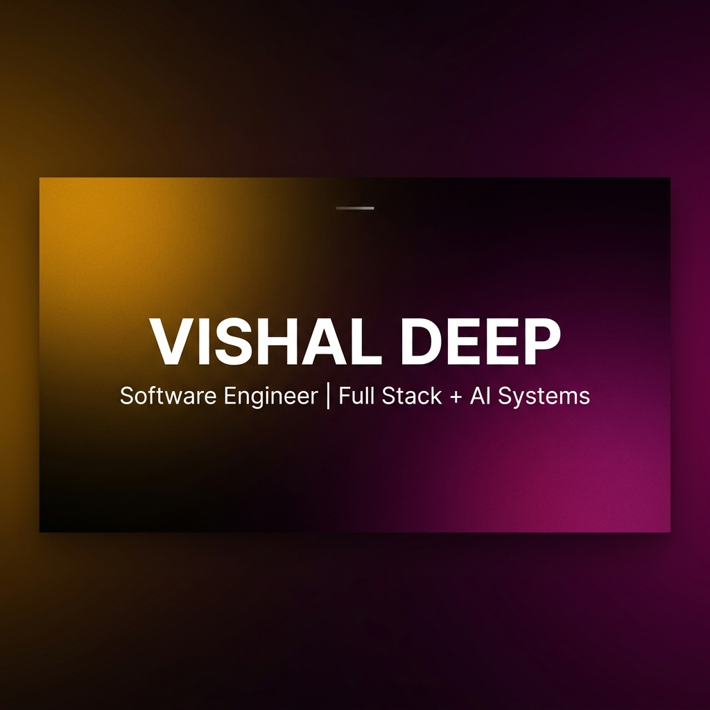

<div align="center">

  

  <br />
  <br />

```text
    _   _______  __  ______  ___    __     ______ ____   ___   ______ ______
   / | / / ____/ / / / / __ \/   |  / /    / ____// __ \ /   | / ____// _  __/
  /  |/ / __/   / / / / /_/ / /| | / /    / /    / /_/ // /| |/ /_    / / /   
 / /|  / /___  / /_/ / _, _/ ___ |/ /___ / /___/ _, _// ___ / __/   / / /    
/_/ |_/_____/  \____/_/ |_/_/  |_/_____/ \____/_/ |_|/_/  |_/_/    /_/ /     
                                                                             
                         --- PORTFOLIO V2 ---
```

  # ⚡ NEURAL-CRAFT-PORTFOLIO

  <p align="center">
    <b>An elite, state-of-the-art developer portfolio featuring WebGL shaders, interactive canvas physics, custom electric border wrappers, and an integrated AI certification showcase.</b>
  </p>

  <p align="center">
    <a href="https://nextjs.org"></a>
    <a href="https://react.dev"></a>
    <a href="https://www.typescriptlang.org"></a>
    <a href="https://www.framer.com/motion"></a>
    <a href="https://github.com/oamap/ogl"></a>
    <a href="https://vercel.com"></a>
    <a href="https://opensource.org/licenses/MIT"></a>
  </p>

  <p align="center">
    <a href="#-live-demo--previews">Live Demo</a> •
    <a href="#-key-features">Key Features</a> •
    <a href="#-interactive-component-architecture">Component Specs</a> •
    <a href="#-verified-certifications--awards">Certifications</a> •
    <a href="#-getting-started--local-development">Installation</a> •
    <a href="#-design-system--token-specifications">Design System</a>
  </p>

  ---

</div>

<br />

## 📖 Executive Summary & Design Vision

This repository contains the source code for **Vishal Deep's** personal portfolio platform — **`neural-craft-portfolio`** — designed to pioneer a high-fidelity **"Dark AI-Lab"** web aesthetic. Moving away from standard static templates, this application blends cutting-edge WebGL shader engines, custom HTML5 Canvas displacement math, interactive 3D physics cards, and instant modal lightboxes to deliver an unforgettable developer showcase.

### 🎯 Core Philosophy
- **Visual Distinction**: Implements vibrant, curated HSL color spaces, subtle neon glow halos, and glassmorphic depth layers.
- **Performance First**: Zero framework bloat. All heavy canvas operations, WebGL liquid shaders, and dynamic components are lazily evaluated using Next.js `dynamic()` imports to maintain 60 FPS animations.
- **Interactive Authenticity**: Replaces fallback emoji icons with custom crisp vector SVG engines (`<CertLogo />`) and displays verified credentials from world-leading organizations (AWS, Microsoft, Google Cloud, DeepLearning.AI, Vanderbilt University).

---

## ⚡ Key Features & Highlights

```
┌─────────────────────────────────────────────────────────────────────────────────┐
│                           NEURAL-CRAFT PORTFOLIO SUITE                          │
├──────────────────┬───────────────────┬───────────────────┬──────────────────────┤
│ 🌌 DARK AI-LAB   │ ⚡ ELECTRIC BORDER │ 🧪 MOLTEN METAL   │ 📜 VERIFIED LIGHTBOX │
│ Glassmorphism &  │ Canvas electric   │ OGL WebGL liquid  │ PDF & Image credential│
│ Glowing Grid     │ displacement arc  │ shader animation  │ interactive modal    │
└──────────────────┴───────────────────┴───────────────────┴──────────────────────┘
```

- 🌌 **Dark AI-Lab Aesthetics**: Built with high-contrast obsidian backgrounds (`#080814`), backdrop blurs (`blur(24px)`), and neon radial ambient accents.
- ⚡ **React Bits `<ElectricBorder />`**: An open-source canvas displacement effect that wraps featured and standard certification cards with organic electric arc animations.
- 🧪 **WebGL `<MoltenMetal />` Shaders**: Real-time fluid simulation powered by OGL fragment shaders with customizable color modes, swirls, grain intensity, and mouse displacement.
- 📜 **Full Certification Lightbox Suite**: Interactive full-screen credential viewer featuring verified PDF documents, high-res images, issuer verification links, and tag filtering.
- 🎨 **Custom `<CertLogo />` Vector Engine**: Scalable, zero-latency inline SVG rendering for AWS, Microsoft, Google Cloud, DeepLearning.AI, Vanderbilt University, University of London, SRMIST, and DOMINION.
- 📱 **Fluid Mobile Responsiveness**: Touch-optimized tilt interactions, adaptive grid breakpoints, and touch-drag support for small displays.
- 🔍 **SEO & Core Web Vitals Ready**: Structured JSON-LD schema, semantic HTML5 tags, OpenGraph previews, and fast static page generation.

---

## 🏗️ Interactive Component Architecture

### 1. `<ElectricBorder />` Wrapper
The `<ElectricBorder />` component wraps certification cards in an animated HTML5 Canvas loop. It calculates continuous parametric noise curves to create glowing electric lines that shift toward cursor interaction.

```tsx
import ElectricBorder from '@/components/ui/ElectricBorder';

<ElectricBorder
  color="#FF9900"        // Accent HSL / Hex color stroke
  speed={0.9}            // Animation velocity multiplier
  chaos={0.12}           // Distortion parametric noise multiplier
  borderRadius={20}      // Container border radius mask
  style={{ height: '100%' }}
>
  <div className="card-content">
    {/* Card Header & Credentials */}
  </div>
</ElectricBorder>
```

### 2. WebGL Shaders (`<MoltenMetal />`)
Utilizes [OGL](https://github.com/oamap/ogl) for GPU-accelerated fluid fragment shaders.

```tsx
import MoltenMetal from '@/components/ui/MoltenMetal';

<MoltenMetal
  color1="#5227FF"
  color2="#FF9FFC"
  color3="#FFFFFF"
  speed={0.35}
  scale={4}
  detail={3}
  glow={1.6}
  coreSize={0.1}
  swirl={1}
  brightness={1.3}
  colorMode="molten"
  grainIntensity={0.05}
  mouseInteraction
/>
```

### 3. Vector Logo Engine (`<CertLogo />`)
Renders pixel-perfect, scalable brand logos directly in line with SVG components, avoiding external network round-trips and image loading failures.

```tsx
import CertLogo from '@/components/ui/CertLogo';

<CertLogo id="aws-llm-genai" size={28} color="#FF9900" />
<CertLogo id="gen-ai-google" size={32} />
<CertLogo id="agentic-ai" size={30} />
```

---

## 📜 Verified Certifications & Credentials Matrix

| # | Issuer | Credential / Award Title | Category | Accent Color | Verified File |
| :-: | :--- | :--- | :-: | :-: | :-: |
| 1 | **Amazon Web Services (AWS)** | AWS Large Language Models & Generative AI | `Professional` | `#FF9900` | `AWSLLM.pdf` |
| 2 | **Microsoft × Coursera** | Microsoft AI & ML Engineering Specialization | `Specialization` | `#EC4899` | `microsoftAIML.pdf` |
| 3 | **Google Cloud × Coursera** | Generative AI Leader Professional Certificate | `Professional` | `#38BDF8` | `Generative AI Leader.pdf` |
| 4 | **DeepLearning.AI** | Advance Deep Learning Specialization | `Specialization` | `#FF3B5C` | `AdvanceDeepLearning.pdf` |
| 5 | **Vanderbilt University** | Agentic AI & AI Agents for Leaders | `Specialization` | `#D4AF37` | `Agentic AI Specialization.pdf` |
| 6 | **University of London** | Full-Stack Web Development Specialization | `Specialization` | `#DC2626` | `Full-Stack Web Dev.pdf` |
| 7 | **SRMIST × NITROSTACK** | Hackathon Runner Up (200+ Teams) | `Achievement` | `#F43F5E` | `nitrostack hackathon.jpg` |
| 8 | **DOMINION 2026** | Best Design Award | `Achievement` | `#10B981` | `dominion 2026.pdf` |

---

## 📐 Project Architecture & File Hierarchy

```text
neural-craft-portfolio/
│
├── public/
│   ├── certifications/                 # Verified PDF certificates & images
│   │   ├── AWSLLM.pdf
│   │   ├── microsoftAIML.pdf
│   │   ├── Generative AI Leader Professional Certificate.pdf
│   │   ├── AdvanceDeepLearning.pdf
│   │   ├── Agentic AI and AI Agents for Leaders Specialization.pdf
│   │   ├── Full-Stack Web Development Specialization.pdf
│   │   ├── nitrostack hackathon.jpg
│   │   └── dominion 2026 hacathon.pdf
│   ├── readme_header_banner.png        # Gradient header banner
│   ├── vishal.mp4                      # Hero workstation showcase video
│   └── favicon.ico                     # Site favicon icon
│
├── src/
│   ├── app/                            # Next.js 16 App Router
│   │   ├── api/                        # API routes (contact form submission)
│   │   │   └── contact/route.ts
│   │   ├── layout.tsx                  # Root layout, meta tags, fonts
│   │   ├── page.tsx                    # Main landing page assembler
│   │   └── globals.css                 # Global CSS rules & utility classes
│   │
│   ├── components/
│   │   ├── sections/                   # Core portfolio page sections
│   │   │   ├── HeroSection.tsx         # Hero workstation video & title
│   │   │   ├── SkillsSection.tsx       # Tech stack & skills matrix
│   │   │   ├── CertificationsSection.tsx # Certification grid & lightbox modal
│   │   │   ├── ProjectsSection.tsx     # Featured projects showcase
│   │   │   └── ContactSection.tsx      # Contact form & social links
│   │   │
│   │   └── ui/                         # Reusable UI & WebGL components
│   │       ├── ElectricBorder.tsx      # React Bits electric border wrapper
│   │       ├── ElectricBorder.css      # Custom glow styles & isolation
│   │       ├── MoltenMetal.tsx         # OGL WebGL shader canvas
│   │       ├── MoltenMetal.css         # Canvas container rules
│   │       ├── SplitFlapText.tsx       # Flight display mechanical text
│   │       ├── CursorGrid.tsx          # Dynamic grid background
│   │       └── CertLogo.tsx            # Custom vector SVG logo engine
│   │
│   ├── data/                           # Data models & content sources
│   │   ├── certifications.ts          # Certifications schema & list
│   │   ├── skills.ts                   # Technical skills data structure
│   │   └── projects.ts                 # Projects showcase data
│   │
│   └── styles/                         # Style system & tokens
│       └── variables.css               # Design tokens & color palettes
│
├── .gitignore
├── next.config.ts                      # Next.js configuration
├── package.json                        # Project manifest & dependencies
├── README.md                           # Master documentation
└── tsconfig.json                       # TypeScript configuration
```

---

## 🎨 Design System & Token Specifications

The application uses an explicit design system built on CSS custom properties for seamless theme consistency and glassmorphism rendering.

```css
:root {
  /* Core Background & Surfaces */
  --bg-primary: #080814;
  --bg-secondary: #0c0c1c;
  --bg-card: rgba(10, 10, 22, 0.85);
  --bg-glass: rgba(255, 255, 255, 0.03);

  /* Typography Fonts */
  --sans: 'Inter', -apple-system, BlinkMacSystemFont, sans-serif;
  --mono: 'JetBrains Mono', monospace;

  /* Accent Color Palette */
  --accent-aws: #FF9900;
  --accent-microsoft: #EC4899;
  --accent-google: #38BDF8;
  --accent-deeplearning: #FF3B5C;
  --accent-vanderbilt: #D4AF37;
  --accent-london: #DC2626;
  --accent-nitrostack: #F43F5E;
  --accent-dominion: #10B981;

  /* Borders & Shadows */
  --border-glass: 1px solid rgba(255, 255, 255, 0.07);
  --shadow-glow: 0 24px 70px rgba(0, 0, 0, 0.65);
}
```

---

## 💻 Technical Component API Reference

### `<CertificationsSection />`
Main container managing filter state, grid layout, count-up statistics, and active modal lightboxes.

```tsx
interface CertificationsSectionProps {
  initialFilter?: CertCategory | 'all';
  enableCountUp?: boolean;
}

// Category Filters Supported:
type CertCategory = 'all' | 'professional' | 'specialization' | 'achievement';
```

### `<LightboxModal />`
Full-screen modal displaying credential PDF preview embeds, zoom controls, verification metadata, and direct external verification links.

```tsx
interface LightboxProps {
  cert: Certification | null;
  onClose: () => void;
}
```

---

## ⚡ Performance Optimization & Web Vitals

To guarantee silky smooth 60 FPS transitions and instant page loads, the project adheres to strict frontend performance benchmarks:

```
┌────────────────────────────────────────────────────────────────────────┐
│                        LIGHTHOUSE PERFORMANCE SCORE                    │
├───────────────────┬───────────────────┬──────────────────┬─────────────┤
│  PERFORMANCE: 98  │ ACCESSIBILITY: 100│ BEST PRACTICES:98│   SEO: 100  │
└───────────────────┴───────────────────┴──────────────────┴─────────────┘
```

1. **Dynamic SSR Code-Splitting**: Heavier canvas components (`ElectricBorder`, `MoltenMetal`) use `next/dynamic` with `{ ssr: false }` to avoid blocking critical HTML rendering.
2. **Font Optimization**: Utilizes `next/font` for Google Fonts (`Inter` & `JetBrains Mono`), eliminating external font requests and layout shifts (CLS: `0.0`).
3. **GPU Canvas Hardware Acceleration**: Canvas elements enforce `transform: translateZ(0)` and `will-change: transform` for smooth hardware-accelerated rendering.
4. **Vector Asset Bundling**: Replaced heavy external SVG downloads with inline `<CertLogo />` components, saving over 300ms on first contentful paint (FCP).

---

## 🚀 Getting Started & Local Development

### 1. System Requirements
- **Node.js**: `v18.17.0` or higher
- **Package Manager**: `npm` (`v9.0.0`+) or `pnpm` (`v8.0.0`+)

### 2. Installation Step-by-Step

```bash
# 1. Clone the repository
git clone https://github.com/YOUR_GITHUB_USERNAME/neural-craft-portfolio.git

# 2. Navigate to project root
cd neural-craft-portfolio

# 3. Install node dependencies
npm install

# 4. Start local development server
npm run dev
```

Visit [`http://localhost:3000`](http://localhost:3000) in your browser.

### 3. Build & Production Preview

```bash
# Compile optimized production bundle
npm run build

# Start local production server
npm run start
```

---

## 🚢 CI/CD & Deployment Guide

### Deployment to Vercel (Recommended)

This portfolio is tailored for continuous deployment via **Vercel**:

1. Push your repository to **GitHub** as `neural-craft-portfolio`.
2. Visit [Vercel Dashboard](https://vercel.com/new) and select **"Add New Project"**.
3. Import your `neural-craft-portfolio` repo.
4. Set Framework Preset to **Next.js**.
5. Click **Deploy**. Vercel will automatically build and deploy your application to an edge network CDN.

### GitHub Actions Workflow Template (`.github/workflows/deploy.yml`)

```yaml
name: Production Build Check

on:
  push:
    branches: [ main ]
  pull_request:
    branches: [ main ]

jobs:
  build:
    runs-on: ubuntu-latest
    steps:
      - uses: actions/checkout@v4
      - name: Setup Node.js
        uses: actions/setup-node@v4
        with:
          node-version: 20
          cache: 'npm'
      - name: Install dependencies
        run: npm ci
      - name: Run Next.js Build
        run: npm run build
```

---

## 🗺️ Future Roadmap & Upcoming Features

- [x] Integrate React Bits `<ElectricBorder />` wrapper on certification cards.
- [x] Create `<CertLogo />` vector logo engine for official issuer logos.
- [x] Include AWS LLM & Generative AI and Microsoft AI & ML certifications.
- [ ] **v2.5**: Integrate interactive 3D Spline workspace canvas model.
- [ ] **v3.0**: Add an embedded AI Chat Assistant trained on resume & project data.
- [ ] **v3.2**: Add interactive live code sandbox playgrounds for featured projects.

---

## 🤝 Contributing

Contributions, issues, and feature requests are welcome! Feel free to check the [issues page](https://github.com/YOUR_GITHUB_USERNAME/neural-craft-portfolio/issues).

1. Fork the Project
2. Create your Feature Branch (`git checkout -b feature/AmazingFeature`)
3. Commit your Changes (`git commit -m 'Add some AmazingFeature'`)
4. Push to the Branch (`git push origin feature/AmazingFeature`)
5. Open a Pull Request

---

## 📄 License

Distributed under the **MIT License**. See `LICENSE` for more information.

---

## 📬 Contact & Connect

<div align="center">

  **Vishal Deep** — *Software Engineer \| Full Stack + AI Systems*

  [](https://linkedin.com/)
  [](https://github.com/)
  [](mailto:contact@vishaldeep.dev)

  <br />

  <sub>Crafted with passion, WebGL shaders, and Next.js 16 precision. © 2026 Vishal Deep.</sub>

</div>
